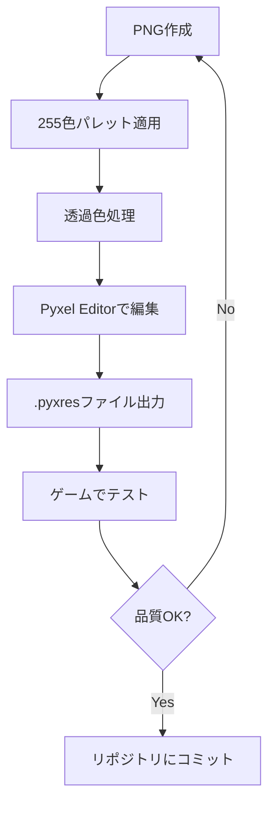

# アセット管理システム設計書

## 版情報
- **バージョン**: 2.0
- **作成日**: 2025年1月
- **基盤**: Pyxel 2.x + 255色パレット + 透過PNG

---

## 1. システム概要

### 1.1 設計目標
- **パフォーマンス**: 起動時間5秒以内、60FPS維持
- **メモリ効率**: 100MB以下のメモリ使用量
- **拡張性**: 新しいアセットの追加が容易
- **品質**: 255色パレット + 透過PNG対応

### 1.2 現在の問題点
- ✗ 98個のPNGファイル一括読み込みでスタック
- ✗ Bank容量不足 (256x256制限)
- ✗ tempfile大量生成でメモリ圧迫
- ✗ 色精度低下 (16色制限)

### 1.3 新システムの利点
- ✓ Pyxel推奨の.pyxresファイル形式使用
- ✓ 段階的・オンデマンド読み込み
- ✓ 255色パレット対応
- ✓ 透過PNG正式サポート

---

## 2. ファイル構成

### 2.1 リソースファイル構成
```
resources/
├── core.pyxres              # 必須アセット (起動時読み込み)
│   ├── Images[0]: UI要素 (128x128)
│   ├── Images[1]: 地形タイル (256x256)
│   └── Tilemaps[0]: UI配置情報
├── buildings_basic.pyxres   # 基本建物 (段階読み込み)
│   ├── Images[0]: 1x1建物 (256x256)
│   ├── Images[1]: 2x2建物 (256x256)
│   └── Sounds[0-3]: 建設音
├── buildings_advanced.pyxres # 高級建物 (オンデマンド)
│   ├── Images[0]: 3x3建物 (256x256)
│   ├── Images[1]: 4x4建物 (256x256)
│   └── Music[0]: BGM
└── palette_255.pyxpal       # 255色パレット
```

### 2.2 アセット命名規則
```
スプライト命名: {type}_{size}_{variant}_{frame}
例:
  - grass_1x1_normal_01      # 草地タイル
  - house_2x2_wooden_01      # 木造住宅
  - factory_3x3_steel_02     # 鉄工場 (アニメーション2フレーム目)
  
UI要素命名: ui_{component}_{state}
例:
  - ui_button_normal         # 通常ボタン
  - ui_button_hover          # ホバー状態ボタン
  - ui_icon_house           # 住宅アイコン
```

---

## 3. アセットマネージャー実装

### 3.1 階層化読み込み戦略

```python
class AssetManager:
    def __init__(self):
        self.loaded_resources = {}
        self.loading_queue = []
        self.cache = {}
        self.load_state = LoadState.NONE
        
    async def initialize(self):
        """段階的初期化"""
        # Phase 1: 必須アセット (起動時)
        await self.load_essential_assets()
        
        # Phase 2: 基本アセット (バックグラウンド)
        await self.load_basic_assets()
        
        # Phase 3: 詳細アセット (オンデマンド)
        self.prepare_advanced_assets()
    
    async def load_essential_assets(self):
        """必須アセット読み込み (2秒以内)"""
        pyxel.load("resources/core.pyxres")
        self.register_ui_sprites()
        self.register_terrain_sprites()
        self.load_state = LoadState.ESSENTIAL_LOADED
    
    async def load_basic_assets(self):
        """基本アセット読み込み (3秒以内)"""
        pyxel.load("resources/buildings_basic.pyxres", 
                  excl_musics=True)  # 音楽は除外
        self.register_basic_buildings()
        self.load_state = LoadState.BASIC_LOADED
    
    def load_on_demand(self, asset_group: str):
        """オンデマンド読み込み"""
        if asset_group not in self.loaded_resources:
            pyxel.load(f"resources/{asset_group}.pyxres")
            self.register_asset_group(asset_group)
```

### 3.2 スプライト管理

```python
class SpriteManager:
    def __init__(self):
        self.sprite_registry = {}
        self.animation_frames = {}
        
    def register_sprite(self, name: str, bank: int, 
                       x: int, y: int, w: int, h: int,
                       transparent_color: int = 14):
        """スプライト登録"""
        self.sprite_registry[name] = SpriteData(
            bank=bank, x=x, y=y, w=w, h=h,
            transparent=transparent_color
        )
    
    def register_animation(self, base_name: str, 
                          frame_count: int, frame_duration: int):
        """アニメーション登録"""
        frames = []
        for i in range(frame_count):
            frame_name = f"{base_name}_{i:02d}"
            if frame_name in self.sprite_registry:
                frames.append(frame_name)
        
        self.animation_frames[base_name] = AnimationData(
            frames=frames, duration=frame_duration
        )
    
    def draw_sprite(self, name: str, x: int, y: int, 
                   flip_x: bool = False, flip_y: bool = False):
        """スプライト描画"""
        if name in self.sprite_registry:
            sprite = self.sprite_registry[name]
            pyxel.blt(x, y, sprite.bank, 
                     sprite.x, sprite.y, sprite.w, sprite.h,
                     sprite.transparent)
    
    def draw_animation(self, name: str, x: int, y: int, frame_time: int):
        """アニメーション描画"""
        if name in self.animation_frames:
            anim = self.animation_frames[name]
            frame_index = (frame_time // anim.duration) % len(anim.frames)
            current_frame = anim.frames[frame_index]
            self.draw_sprite(current_frame, x, y)
```

### 3.3 255色パレット管理

```python
class PaletteManager:
    def __init__(self):
        self.current_palette = None
        self.palette_cache = {}
        
    def load_255_color_palette(self, palette_file: str):
        """255色パレット読み込み"""
        try:
            # Pyxelパレットファイル読み込み
            with open(palette_file, 'r') as f:
                colors = []
                for line in f:
                    hex_color = line.strip()
                    if len(hex_color) == 6:
                        r = int(hex_color[0:2], 16)
                        g = int(hex_color[2:4], 16)
                        b = int(hex_color[4:6], 16)
                        colors.append((r, g, b))
                
                self.current_palette = colors
                return True
        except Exception as e:
            print(f"Failed to load palette: {e}")
            return False
    
    def apply_palette(self):
        """パレットをPyxelに適用"""
        if self.current_palette:
            for i, (r, g, b) in enumerate(self.current_palette):
                if i < 256:  # Pyxelの制限
                    pyxel.colors[i] = r << 16 | g << 8 | b
```

---

## 4. PNG透過処理

### 4.1 Pyxel Editorでの前処理

```python
# PNG → .pyxres 変換ツール
class AssetConverter:
    def __init__(self):
        self.palette_manager = PaletteManager()
        
    def convert_png_to_pyxres(self, png_path: str, output_path: str):
        """PNG画像を.pyxresに変換"""
        # 1. PNG読み込み
        img = Image.open(png_path).convert('RGBA')
        
        # 2. 255色パレットにマッピング
        mapped_img = self.map_to_palette(img)
        
        # 3. 透過色処理 (色14を透過に設定)
        processed_img = self.process_transparency(mapped_img)
        
        # 4. Pyxel Imageに変換
        pyxel_img = self.create_pyxel_image(processed_img)
        
        # 5. .pyxresファイルに保存
        pyxel.save(output_path)
    
    def map_to_palette(self, img: Image.Image) -> Image.Image:
        """255色パレットにマッピング"""
        palette = self.palette_manager.current_palette
        result = Image.new('RGB', img.size)
        
        for y in range(img.height):
            for x in range(img.width):
                r, g, b, a = img.getpixel((x, y))
                
                if a < 128:  # 透過ピクセル
                    # 色14 (ピンク) を透過色として使用
                    result.putpixel((x, y), (255, 151, 152))
                else:
                    # 最も近い色を検索
                    closest_color = self.find_closest_color(r, g, b, palette)
                    result.putpixel((x, y), closest_color)
        
        return result
    
    def find_closest_color(self, r: int, g: int, b: int, 
                          palette: List[Tuple[int, int, int]]) -> Tuple[int, int, int]:
        """最も近い色を検索"""
        min_distance = float('inf')
        closest = (0, 0, 0)
        
        for color in palette:
            if color == (255, 151, 152):  # 透過色をスキップ
                continue
                
            distance = (r - color[0])**2 + (g - color[1])**2 + (b - color[2])**2
            if distance < min_distance:
                min_distance = distance
                closest = color
                
        return closest
```

### 4.2 実行時透過処理

```python
class TransparencyManager:
    TRANSPARENT_COLOR = 14  # Pyxelの透過色インデックス
    
    @staticmethod
    def draw_with_transparency(bank: int, dx: int, dy: int,
                              sx: int, sy: int, sw: int, sh: int):
        """透過対応描画"""
        pyxel.blt(dx, dy, bank, sx, sy, sw, sh, 
                 TransparencyManager.TRANSPARENT_COLOR)
    
    @staticmethod
    def is_transparent_pixel(color_index: int) -> bool:
        """ピクセルが透過色か判定"""
        return color_index == TransparencyManager.TRANSPARENT_COLOR
```

---

## 5. パフォーマンス最適化

### 5.1 メモリ管理

```python
class MemoryManager:
    def __init__(self, max_memory_mb: int = 100):
        self.max_memory = max_memory_mb * 1024 * 1024
        self.current_usage = 0
        self.cache = {}
        self.lru_order = []
    
    def cache_sprite(self, name: str, data: SpriteData):
        """スプライトをキャッシュ"""
        if self.current_usage + data.size > self.max_memory:
            self.evict_lru()
        
        self.cache[name] = data
        self.lru_order.append(name)
        self.current_usage += data.size
    
    def evict_lru(self):
        """LRUでキャッシュエビクション"""
        while self.lru_order and self.current_usage > self.max_memory * 0.8:
            oldest = self.lru_order.pop(0)
            if oldest in self.cache:
                self.current_usage -= self.cache[oldest].size
                del self.cache[oldest]
```

### 5.2 描画最適化

```python
class RenderOptimizer:
    def __init__(self):
        self.visible_sprites = []
        self.frustum = None
        
    def update_frustum(self, camera_x: int, camera_y: int, 
                      screen_w: int, screen_h: int):
        """視界カリング用の視錐台更新"""
        self.frustum = Rect(camera_x, camera_y, screen_w, screen_h)
    
    def is_sprite_visible(self, sprite_x: int, sprite_y: int,
                         sprite_w: int, sprite_h: int) -> bool:
        """スプライトが画面内にあるか判定"""
        sprite_rect = Rect(sprite_x, sprite_y, sprite_w, sprite_h)
        return self.frustum.intersects(sprite_rect)
    
    def batch_draw_sprites(self, sprites: List[SpriteDrawCall]):
        """スプライトをバッチ描画"""
        # 同一バンクでグループ化
        by_bank = {}
        for sprite in sprites:
            if sprite.bank not in by_bank:
                by_bank[sprite.bank] = []
            by_bank[sprite.bank].append(sprite)
        
        # バンクごとに描画
        for bank, sprite_list in by_bank.items():
            for sprite in sprite_list:
                pyxel.blt(sprite.dx, sprite.dy, bank,
                         sprite.sx, sprite.sy, sprite.sw, sprite.sh,
                         sprite.transparent)
```

---

## 6. 開発ワークフロー

### 6.1 アセット作成プロセス



### 6.2 自動化ツール

```python
# アセット変換自動化
class AssetPipeline:
    def __init__(self):
        self.converter = AssetConverter()
        self.validator = AssetValidator()
    
    def process_asset_directory(self, input_dir: str, output_dir: str):
        """ディレクトリ内の全PNGを処理"""
        for png_file in glob.glob(f"{input_dir}/*.png"):
            # 1. 変換
            pyxres_file = self.converter.convert_png_to_pyxres(
                png_file, f"{output_dir}/{Path(png_file).stem}.pyxres"
            )
            
            # 2. 検証
            if self.validator.validate_pyxres(pyxres_file):
                print(f"✓ {png_file} converted successfully")
            else:
                print(f"✗ {png_file} conversion failed")
    
    def optimize_pyxres_files(self, directory: str):
        """.pyxresファイルを最適化"""
        for pyxres_file in glob.glob(f"{directory}/*.pyxres"):
            # 未使用領域の削除、圧縮など
            self.optimize_file(pyxres_file)
```

---

## 7. テスト戦略

### 7.1 アセット整合性テスト

```python
class AssetTests:
    def test_all_sprites_loadable(self):
        """全スプライトが読み込み可能か確認"""
        asset_manager = AssetManager()
        
        for sprite_name in REQUIRED_SPRITES:
            sprite = asset_manager.get_sprite(sprite_name)
            assert sprite is not None, f"Sprite {sprite_name} not found"
    
    def test_transparency_correct(self):
        """透過色が正しく設定されているか確認"""
        # 透過色14が実際に透明に描画されるかテスト
    
    def test_palette_integrity(self):
        """255色パレットが正しく適用されているか確認"""
        palette_manager = PaletteManager()
        palette_manager.load_255_color_palette("resources/palette_255.pyxpal")
        
        assert len(palette_manager.current_palette) == 256
        # 特定の色が正しくマッピングされているかテスト
```

### 7.2 パフォーマンステスト

```python
class PerformanceTests:
    def test_loading_time(self):
        """読み込み時間が目標以内か確認"""
        start_time = time.time()
        asset_manager = AssetManager()
        asset_manager.initialize()
        load_time = time.time() - start_time
        
        assert load_time < 5.0, f"Loading took {load_time}s, target: 5s"
    
    def test_memory_usage(self):
        """メモリ使用量が目標以内か確認"""
        import psutil
        process = psutil.Process()
        
        asset_manager = AssetManager()
        asset_manager.load_all_assets()
        
        memory_mb = process.memory_info().rss / 1024 / 1024
        assert memory_mb < 100, f"Memory usage: {memory_mb}MB, target: 100MB"
```

---

## 8. マイグレーション計画

### 8.1 段階的移行

**Phase 1**: 新アセットシステム構築
- [ ] AssetManager, SpriteManager実装
- [ ] 255色パレット対応
- [ ] PNG→.pyxres変換ツール作成

**Phase 2**: 既存アセット変換
- [ ] 現在のPNGファイルを.pyxres形式に変換
- [ ] アセット登録情報をJSONで管理
- [ ] 変換の品質確認

**Phase 3**: システム統合
- [ ] 新アセットシステムをゲームに統合
- [ ] 旧システムから新システムに切り替え
- [ ] パフォーマンステスト

**Phase 4**: 最適化・ポリッシュ
- [ ] メモリ使用量最適化
- [ ] 読み込み時間短縮
- [ ] 品質保証・リリース

---

*このシステムにより、高品質で高性能なアセット管理を実現し、ゲーム開発の生産性を大幅に向上させます。*